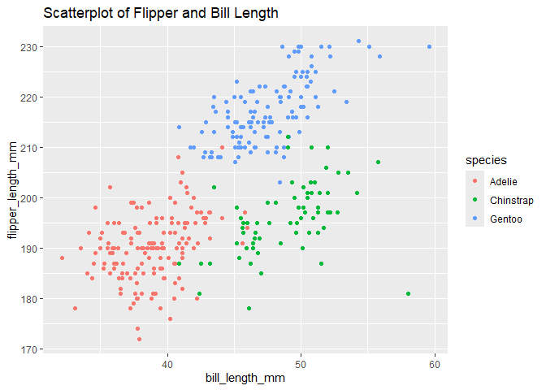

p8105_hw1_yc4584
================
Yingyu Cui
2024-09-17

# Problem 1

- now load the penguins dataset from the palmerpenguins package

``` r
data("penguins", package = "palmerpenguins")
```

This is a short discription for the dataset:

- the dataset includes following variables: species, island,
  bill_length_mm, bill_depth_mm, flipper_length_mm, body_mass_g, sex,
  year.

  the dataset includes 344 rows and 8 columns.

  the mean flipper length is 200.9152047mm.

This is the scatterplot of flipper_length_mm (y) vs bill_length_mm (x).

``` r
library(ggplot2)
scatterplot = ggplot(penguins, aes(x = bill_length_mm, y = flipper_length_mm, color = species)) +
  geom_point() +
  labs(
    title = "Scatterplot of Flipper and Bill Length",
    x = "bill_length_mm",
    y = "flipper_length_mm",
    color = "species"
  )
print(scatterplot)
```

<!-- -->

``` r
ggsave(filename = "Scatterplot of Flipper and Bill Length.png", plot = scatterplot)
```
